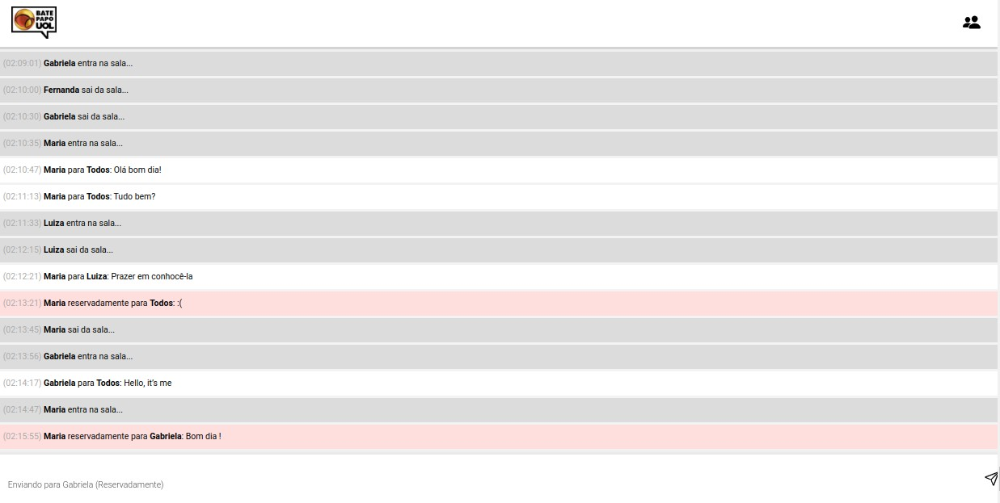
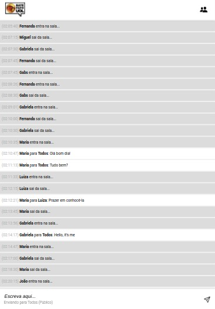
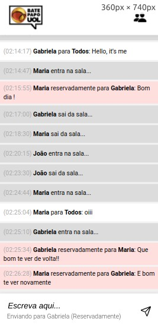
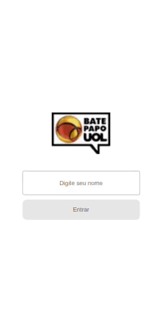

# 
Bate Papo UOL

### 
Inspiração do chat UOL

   
   
    
   

### :clipboard: Descrição

Implementação de um bate-papo totalmente funcional, inspirado no saudoso Bate-Papo UOL.

O usuário poderá fazer o login e desfrutar do chat juntamente com os demais, em tempo real, mandando mensagens para todos ou para alguém em particular (sem que ninguém mais veja).

#### 💬 [Acesse aqui](https://gabrielatiago.github.io/BatePapoUOL/)

---

### :computer: Telas

##### Desktop:

##### Tablet:

##### Mobile:

    
    
    

$~$

---

### 🎮 Using

    

$~$

---

### :books: Lições Aprendidas

- Consumo de uma API
- Eventos de teclado
- Uso do switch case
- Separação de responsabilidades
- Código limpo

---

### :bulb: Reconhecimentos

- [Badges para Github](https://github.com/alexandresanlim/Badges4-README.md-Profile#-database-)
- [README Inspiração de README](https://gist.github.com/luanalessa/7f98467a5ed62d00dcbde67d4556a1e4#file-readme-md)
- [Driven Education](https://www.driven.com.br)

---

### 👩‍🦱 Autora

- Gabriela Tiago é uma aluna de desenvolvimento web de Fullstack na Driven Education. Percorrendo o caminho do conhecimento, buscando aprimorar suas habilidades técnicas e de softskills, para que ela possa melhorar o trabalho que desenvolve.

 [🔝 De volta ao topo](#bate-papo-uol) 
